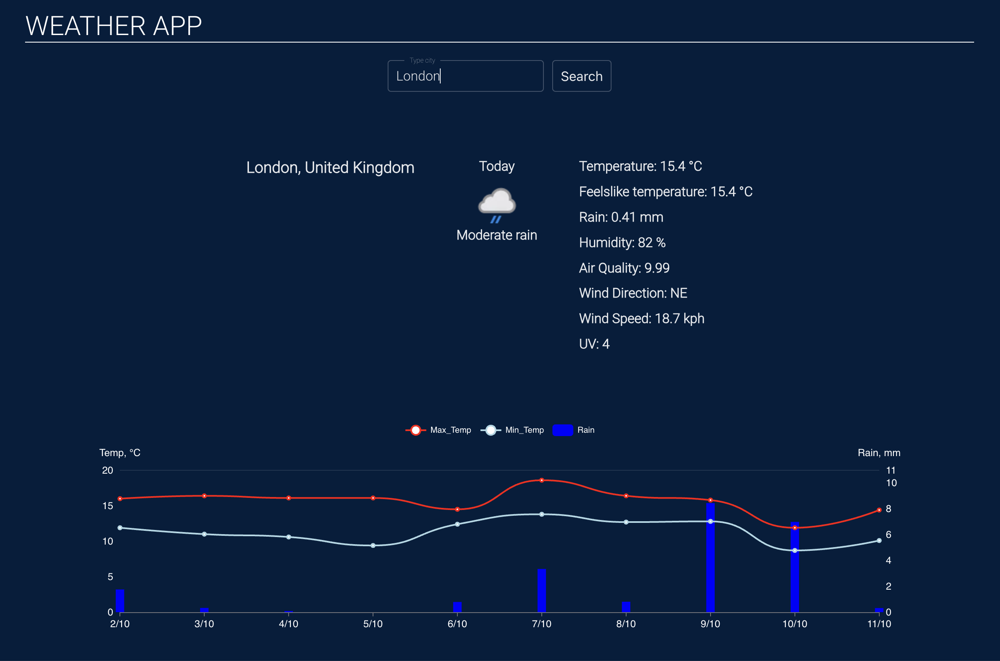
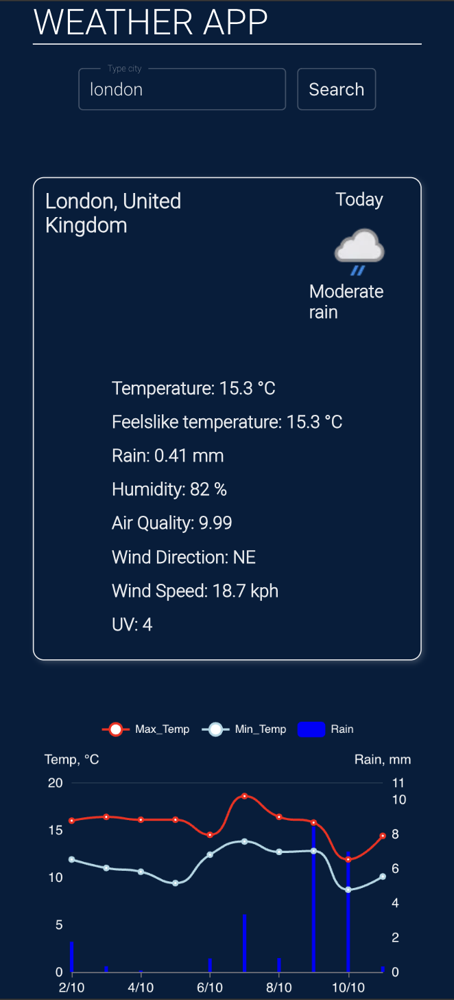

# Weather API
React Weather single page application.

## Functionalities
- today weather forecast for given city (temperature, rain, humidity, air quality, wind direction, wind speed)
- weather chart for 10 dats for given city (temerature max and min and precipitaion)

## Demo:
https://weather-app-14bef.web.app/

## Tech stack:
- React Js
- Rest API
- Eslint
- SCSS
- Echarts Apache (https://github.com/apache/echarts)

## Tech stack:

- React Js
- Rest API
- Eslint
- SCSS

## Weather API
https://www.weatherapi.com/

## Screenshot:
- Dektop

- Mobile
